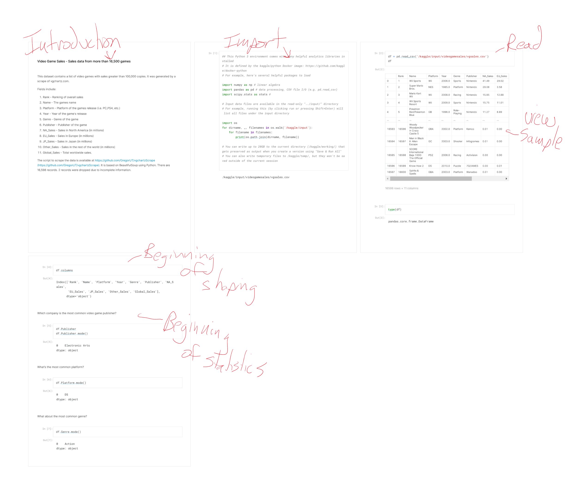

# Stream Stats

## Team Members: Cody Delatorre, Ian F. Shirley, Nicholas Seidel, Ricardo Soto-Fabela, Keyan Tabor

### Cooperation Plan

- Every person on your team is an asset. This is your chance to discover the hidden strengths and areas for growth for each team member.
- Describe at least:
  - What are the key strengths of each person on the team?
    - Nick - process management, code structures, conflict resolution
    - Keyan - Comedic relief, chat GPTing, and teamwork/leading
    - Ian - Task Tracking, Project Management/Communication
    - Cody - CSS, time management, ChatGPT
    - Ricardo - Team player, Data science, ChatGPT
  - How can you best utilize these strengths in the execution of your project?
    - Nick - consult with team members about goals and blockers; aid in resolution
    - Keyan - help the team relieve stress when working endless hours
    - Ian - Making sure we are understanding each other’s ideas and are on the same page. Keeping track of our progress and remaining tasks.
    - Cody - project planning
    - Ricardo - Making sure our team needs are being met. 
  - In which professional competencies do you each want to develop greater strength?
    - Nick - time management, staying in scope; more creative
    - Keyan - Public Speaking, networking, time management
    - Ian - Craft competency: Innovation, tool proficiency
    - Cody - Networking
    - Ricardo - Networking, communication.
  - Knowing that every person in your team needs to understand all aspects of the project, how do you plan to approach the day-to-day work?
    - Build a plan for the day (checklist perhaps) during a morning 10-min huddle; consider individual  strengths, divvy workload amongst team; if struggling ask for pair/team help afternoon check-n for end of day tasks and needs for the next day.  Take regularly scheduled “human time” each hour. If someone is spinning their wheels (15-min rule); speak up.

**NOTE**: *Undoing, Redoing, Replacing, or otherwise steamrolling the project as an individual is considered to be unacceptable. Account for the inevitable divergence of ideas, execution tasks, and assignments of duties here.*

### Conflict Resolution Plan

- What will be your group’s process to resolve conflict, when it arises?
  - Address immediately
  - Inform all team members
  - Listen, analyze, develop a resolution jointly (if possible)
- What will your team do if one person is taking over the project and not letting the other members contribute?
  - Inform team member of concern
  - Develop alternate work plan
- How will you approach each other and the challenges of the project knowing that it is impossible for all members to be at the exact same place in understanding and skill level?
  - Acknowledge strengths and weaknesses
  - Willingness to assist
  - Patience
  - Utilize pair/mob programming when needed
  - Team huddle on concepts
  - Communicate
- How will you raise concerns to members who are not adequately contributing?
  - Ask/reach out, don’t assume
  - Mutual communication
  - Professionalism
  - Empathy is needed
- How and when will you escalate the conflict if your resolution attempts are unsuccessful?
  - After an unsuccessful group resolution meeting; notify instructor of issues not solvable within team

### Communication Plan
 
- What hours will you be available to communicate collectively?
  - Nick - 0900 PST - 1600 PST
  - Keyan - 0200 PST - 0700 PST
  - Ian - 0900 PST - 1800 PST
  - Cody - 0900 - 1700 PST
  - Ricardo - 0900 - 1700 PST
  - **Team will break for lunch at roughly 1200 PST**
- What platforms will you use to communicate (ie. Slack, phone …)
  - Slack, Remo, Google Meet
- How often will you take breaks?
  - Hourly (10 mins)
- What is your plan if you start to fall behind?
  - Re-evaluate the necessity of our tasks, determine if we have to rescale our plan. 
  - Ensure MVP is primary goal
- How will you communicate after hours and on the weekend?
  - Slack
- What is your strategy for ensuring everyone’s voice is heard?
  - Allowing everyone the opportunity to speak in the meetings. 
  - Open to voices anytime
- How will you ensure that you are creating a safe environment where everyone feels comfortable speaking up?
  - Constructive criticism only
  - Have an open mindset when listening to others.
  - Be respectful and mindful

### Work Plan

**NOTE:** *While researching and experimentation is always encouraged, writing and/or committing code to the project on your own during non-working hours or over the weekend is never acceptable. This puts the entire project at risk. Be explicit in calling out your work hours and the distribution of tasks.*

- How will you identify tasks, assign tasks, know when they are complete, and manage work in general?
  - Talk about what needs to be worked on for the day.
  - Inform chat of completions and not wait for a meeting to inform completion.
  - Update project board.
- What project management tool will be used?
  - [Jira](https://401-project.atlassian.net/jira/software/projects/MT401/boards/1)
 
### Presentation Deck

[Presentation Deck](https://docs.google.com/presentation/u/1/d/1UJAz8nlrGIOFZqu0itrMZmd8b7jN0KVP/edit) 
- Planning to present Friday at : ?

### Git Process

- What components of your project will live on GitHub?
  - Use GitHub repositories for projects
  - How will you share the repository with your teammates?
    - Created organization for this project, access available for team; use Jira integration
- Git Flow / Pull Request Review Policy
  - Create branches for each work (individual/mob)
  - peer/code review
  - 2 approval for merging on Main branch
  - 1 approval for development branch as a rule, but if you think there may be a conflict, ask team to review before merging
  - Who merges PRs?
    - Primary: partner/peer
    - Secondary: alternate team/peer
  - How often will you merge?
    - Completion of feature task (working code)
    - End of the work day minimum
    - Upon request (check-in with team if a merge is needed outside of the above 2 situations)
  - How will you communicate that it’s time to merge?
    - Slack (Remo or Google Meet if we are already in there as a group)

### Cobra Kings - Cody, Ian, Keyan, Nick, Ricardo
# Group Project: Stream Stats
# Begin Wireframes & Software Requirements

## Wireframes

## User Stories
“As a Netflix user, I want to know how much time I spent watching Is It Cake, but Netflix doesn’t have any options to do so automatically.” - Small (effort to code)
* Feature Tasks
1. User can see how much time spent watching show
2. User can see which days spent watching show
3. User can see the likelihood of which day he or she will watch a show
* Acceptance Tests
1. Notebook must provide reliable results by show name
2. Limited data points must inform user that regression may be inaccurate

“As a Netflix user, I want to know how much time I spend on netflix throughout the year or different intervals if possible. - Moderate (effort to code)
* Feature Tasks
1. User can see how much time total spent on netflix
2. User can see how many days in a week on average they watch
3. User can see the days most likely to watch
* Acceptance Tests
1. Notebook must output accumulated watch time and determine the day most likely to be watched on

“As a Netflix user, I want to know the genre I watch the most ” - Small (effort to code)
* Feature Tasks
1. User can how much time they watch different genres
2. User can see which genre they watch the most
* Acceptance Tests
1. Notebook must output different genres from netflix and their watch times

“As a Netflix user, I want to get my personal data from them and be able to compare with my friends who is the biggest couch nerd. - Large (effort to code)
* Feature Tasks
1. I want to be able to create charts to see who watches the most anime
2. I like to see at what time do we usually sit down and watch Netflix
3. As a user I want to know for how long on average do we spend a day relaxing
* Acceptance Tests
1. Notebook must show graphs related to my tasks.
2. Be presentable enough to tell a story to anyone looking at it.

“As a Netflix user, I want to be able to look at my usage data in different ways.” - Small (effort to code)
* Feature Tasks
1. User can see their top 5 most-watched shows/movies.
2. User can see what time of day they watch netflix most often.
3. User can see all the different genres they watch and visualize the distribution.
* Acceptance Tests
1. Notebook must display clear visualizations of the usage data the user wants to see.

## Vision

Our vision is a useful Jupyter notebook that will give insight to one’s viewing history from Netflix as well as an opportunity to compare and share with others.  This detailed viewing data is not available through the app or website, only viewing history (title and date) can be viewed.  As we progress into the data-age, it’s important to be aware of what companies can infer from the data you have agreed to share with them.  We hope this will give a user some idea of what Netflix can infer about themself.

## Scope (In/Out)

IN - What will your product do
The Jupyter notebook(using Kaggle) will provide a user statistics and visualizations about his or her viewing history.
The notebook will provide both bar and pie charts.
Users will be able to export their results and shaped data into a file.
Stretch: Users will be able to select the colors they wish to use in visualizations

OUT - What will your product not do.
We do not intend to utilize a server or website; Kaggle has ample ability to view, share, comment, and rate on that platform.
It will not obtain a user’s data or store any passwords
It will not change the user data values; it will only change the type, i.e. object to date/time

## Minimum Viable Product

* collect user profile data in a Kaggle notebook
* display user profile statistics for total time watched, favorite show, etc.
* display “fancy” visualizations for various correlations/statistics

Stretch
* build a front end to display the notebook
* compare data with others
* provide other related stats on visual entertainment/streaming

## Software Requirements

### Functional Requirements
* A user can upload their unaltered data files in .csv format
* A user can download results of notebook
Stretch: A user can change the color of visualizations

### Data Flow
* A user will open the notebook and will need to upload an original, unaltered  csv. with Netflix data
* The user will then need to “run all” to generate the notebook with his or her Netflix data
* The user can scroll through the notebook viewing data results and statistics

### Non-Functional Requirements

* Security
1. The notebook will not store data publicly, nor will it save/export user data elsewhere
* Usability
1. The notebook will be usable to any user with an unaltered .csv from Netflix
* Testability
1. The notebook will be testable through the use of common structure between users
2. The notebook will also allow rapid deployment and visualization of rendered content

## Domain Modeling - TBD later
Draw out the entities for your project and how they are related to each other. Determine the relationships between the functions/methods and entities of your app.
Include in your domain model the names and data types of your entities and their properties.
Do some research on domain modeling and create your own diagram that represents your app. Here are some helpful resources as a starting point:
Brief introduction to Domain Modeling
Domain Modeling
Domain driven architecture diagram
Include this domain model in the README.md file located in your project’s GitHub repo.

